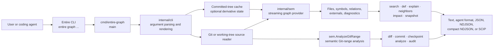
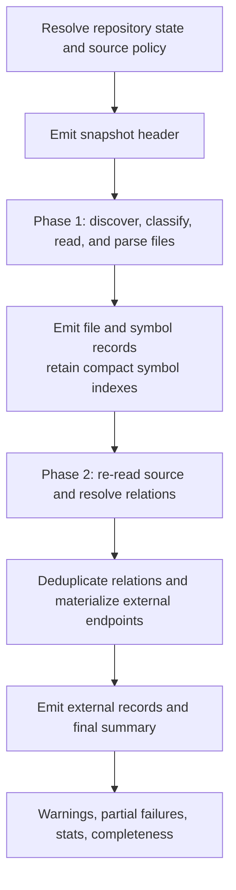

# Entire Graph architecture

Entire Graph is a local code-intelligence provider packaged as an external
command for the Entire CLI. The executable is named `entire-graph`; the parent
CLI dispatches it when a user runs `entire graph <command>`.

The design separates graph construction from command-specific views. One
deterministic provider pipeline discovers source, parses files, extracts
symbols and relations, and reports completeness. Interactive graph queries and
exports consume provider snapshots; change analysis uses a separate semantic
Git-range parser in the same `sem` package.

## System at a glance



All analysis is local. The provider parses repository content with bundled
tree-sitter grammars and uses Git for repository state and committed blobs. It
does not make network requests, use hosted embeddings, or call model APIs.

## Major components

| Area | Responsibility | Primary locations |
| --- | --- | --- |
| Entrypoint | Converts a process invocation into a CLI run and renders safe errors. | `cmd/entire-graph/main.go` |
| CLI | Dispatches commands, resolves repositories and flags, chooses output formats, and turns snapshots into user-facing answers. | `internal/cli/` |
| Semantic engine | Builds snapshots, parses languages, creates stable symbols, resolves relations, performs semantic Git-range analysis, and reports coverage. | `internal/sem/` |
| Git boundary | Reads repository metadata, tracked files, commits, and worktrees through constrained Git operations. | `internal/gitutil/` |
| File digest | Computes bounded file identity and content metadata. | `internal/filedigest/` |
| Terminal safety | Neutralizes control characters and record-shaped repository content at terminal and JSON output boundaries. | `internal/termsafe/` |
| Bench tooling | Runs retrieval and resource benchmarks outside the production provider path. | `cmd/graph-bench/`, `internal/bench/`, `bench/` |

The plugin declaration in `entire-plugin.yml` registers the `graph` command.
`internal` packages are intentionally not a public Go API; the stable
integration boundary is the command output and the snapshot schema.

## Graph construction pipeline

The provider’s central entry point is `sem.StreamSnapshot`. It emits a record
stream instead of retaining source content or all relations in memory.



### Source selection and policy

Before parsing, the provider chooses one source view:

- **Working tree:** interactive commands use checked-out files by default so
  uncommitted changes are visible.
- **Committed tree:** `--head`, bulk exports, and ref-based analysis read Git
  objects. This is the cacheable source mode.
- **Path policy:** repository ignore rules, `.graphignore`, caller-selected
  include/exclude files, and built-in credential-store exclusions shape the
  corpus before it reaches the parser.

The source context supplies file paths and bounded, on-demand readers. File
bytes are processed per file and discarded; oversized, unavailable, and
unparseable inputs become structured diagnostics rather than silent omissions.

### Phase 1: files and symbols

Worker tasks classify each admitted path, select a language parser, and extract
entities. A deterministic reducer consumes results in original path order, so
parallelism does not change output order. It emits `file` and `symbol` records
as it goes and retains only the metadata needed to resolve relations later.

Symbol IDs use the `compound-v1` scheme. The project treats stability across
ordinary edits as a compatibility contract. The provider also reports each
present language’s tier: semantic parsing, or inventory-only discovery where
relation analysis is not promised.

### Phase 2: relations and summary

The provider re-reads file content and resolves relations against the retained
indexes. Relation families include containment and imports; calls and
construction; type, inheritance, field, and data-flow use; framework routes;
configuration dependencies; and historical file co-change evidence. External
endpoints are represented separately from in-repository symbols.

Relations are filtered by the selected profile, deduplicated, and emitted as a
stream. The final `summary` record contains language coverage, warnings,
partial failures, counts, and completeness data. Consumers should preserve and
surface those diagnostics: static extraction is useful evidence, not proof of
runtime behavior.

## Command layer

`cli.Run` in `internal/cli/root.go` dispatches each verb. The graph-query and
export families consume provider snapshots. Change-analysis commands use the
semantic Git-range analyzer; both paths share parsing, source-policy, and
diagnostic conventions but have different output contracts.

| Command family | Role | Typical input/output |
| --- | --- | --- |
| Interactive queries | `search`, `def`, `explain`, `neighbors`, `impact` answer a focused developer question. | Working tree by default; text, agent, or JSON answers. |
| Bulk export | `snapshot`, `symbols`, `edges`, `snapshot-query` expose graph data to tools. | Committed tree by default; streaming NDJSON, compact NDJSON, or SCIP where supported. |
| Change analysis | `diff`, `commit`, `checkpoint`, `analyze`, `audit` compare semantic entities and verification evidence. | Git revisions and structured reports. |
| Setup and operations | `init-agents`, `agent-guide`, `index`, `doctor`, `capabilities`, `version`, `stats`, `verify`. | Installation checks, activation, caching, capability discovery, or controlled test execution. |

`search` ranks source regions from natural-language queries and renders a
bounded context payload. `neighbors` follows direct graph relationships;
`impact` composes callers, callees, type consumers, data flows, co-change
evidence, and siblings into a bounded blast-radius report. `audit` combines a
semantic diff with one full committed-tree snapshot. It creates a conservative
surface from changed symbols and direct resolved `CALLS`/`CONSTRUCTS` neighbors,
then accepts Go structural test evidence only from direct resolved relations
originating in `*_test.go` symbols. Its verdict explicitly does not assert
runtime coverage, program correctness, or safety; see the
[evidence model](evidence-model.md) and [audit policy](audit-policy.md).

## Profiles and caching

Profiles control extraction cost and fidelity. `syntax-only` keeps structural
information, `fast` is the normal search-oriented balance, and `full` enables
the broadest relation and evidence extraction. `capabilities --json` is the
machine-readable source of truth for supported languages, relations, and
profiles.

Cache entries are compressed derivative snapshots, never repository source.
They are valid only for committed-tree views and are keyed by graph-shaping
inputs such as repository identity, tree, provider version, profile, limits,
selection rules, and `.graphignore`. Working-tree queries always rebuild to
avoid treating mutable checkout content as safely reusable.

`index` prewarms one exact committed-tree cache variant. A later query must use
`--head` and compatible flags to reuse it. The cache boundary and key design
are specified in [ADR 0002](adr/0002-committed-tree-cache-key.md) and
[ADR 0004](adr/0004-working-tree-cache-security-boundary.md).

## Data contracts and compatibility

The native integration format is a streaming NDJSON snapshot: header first,
then file, symbol, external, and relation records, followed by a summary.
Schema 1.x is additive-only. Consumers must tolerate fields they do not know
and must check warnings, partial failures, language tiers, and capabilities
before treating an absent result as a negative fact.

The detailed wire contract is in [snapshot format](snapshot-format.md), and
the compatibility rules are in [ADR 0001](adr/0001-ga-schema-contract.md).
SCIP is an experimental complete-snapshot projection; NDJSON remains the
lossless native format.

## Security boundaries

The trust model deliberately keeps data acquisition, output, and execution
separate:

- **Read:** queries read repository content and invoke local Git; `stats` also
  reads explicitly selected local agent transcripts.
- **Write:** commands may write derivative caches, generated agent guides, or
  caller-named report/baseline files. They do not edit application source.
- **Execute:** only `verify` (and its optional setup command) executes a
  caller-supplied command. A `VERIFY:` line in search output is only a
  suggestion and must be reviewed before execution.
- **Render:** output is passed through terminal-safety guards so repository
  content cannot impersonate command records or inject terminal controls.

See [trust and security](trust-and-security.md) for the full boundary,
including credential-path exclusions and cache hardening.

## Extending the system

When adding a language or relation family, update parsing, extraction,
capability reporting, fixtures, and documentation together. Never silently
drop unsupported input: represent incomplete coverage with structured warnings
or partial failures. Preserve the schema’s additive-only 1.x contract and the
stable symbol-ID rules.

For a new CLI command, keep `cmd/entire-graph/main.go` thin, add dispatch and
flag/help behavior under `internal/cli/`, reuse the provider rather than adding
a second graph builder, and write a focused test beside the command. The
standard repository verification surface is defined in `mise.toml`:

```sh
mise run build
mise run test
mise run check
```
